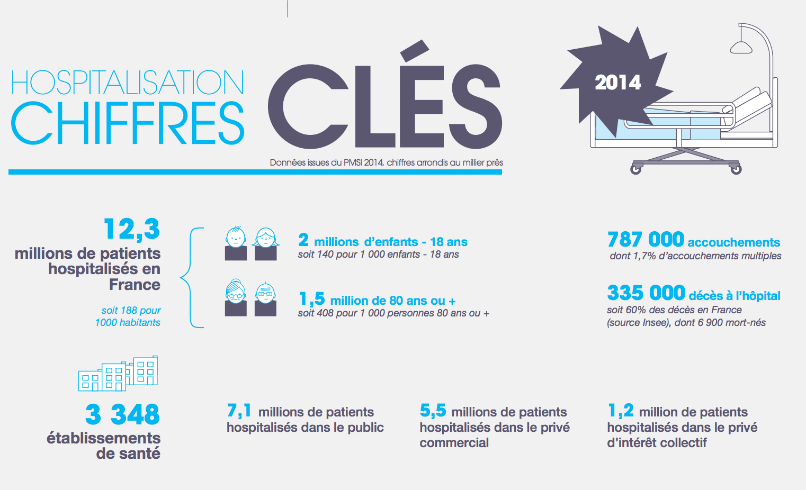
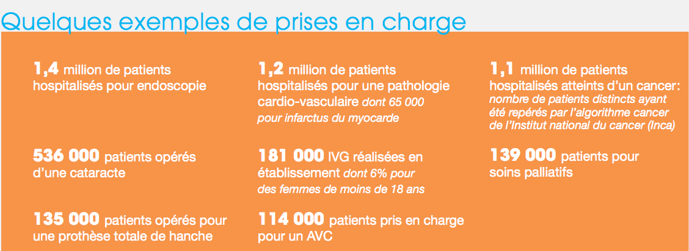
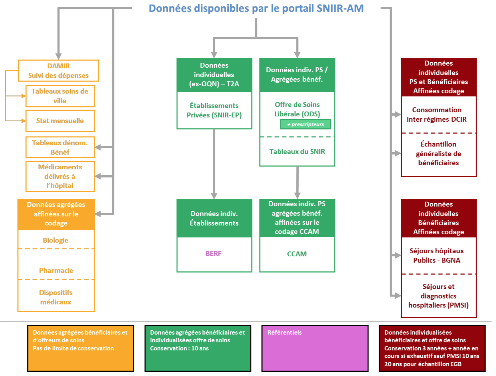
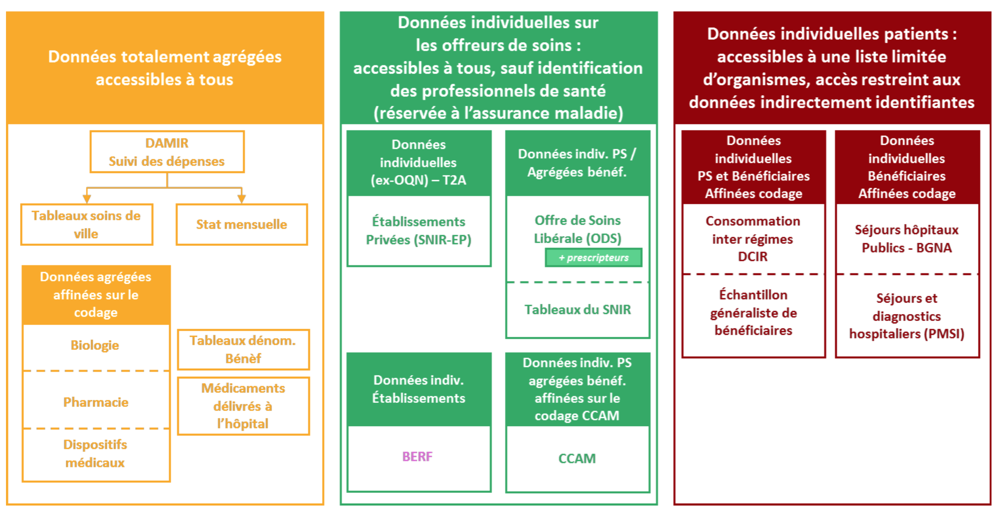

# 1.3. Les principaux entrepôts de données

Comme évoqué dans le paragraphe sur le parcours de soins, les informations médico-administratives et d’hospitalisations collectées sont stockées majoritairement dans les deux entrepôts de données distincts que sont le PMSI et le SNIIRAM. Ce chapitre vise donc à faire un état de l’art des principaux entrepôts de données de l’assurance maladie.

> ## Historique sur les bases de données

> Cette partie se veut faire un bref rappel sur la raison pour laquelle il est encore compliqué d’admettre qu’un système de stockage regroupe un vaste champ d’informations à caractère personnel.

> Pour détailler cela, deux événements historiques :

> - Les **machines Hollerith**[^1]. Elles sont une innovation qui a permis d’accélérer le recensement de la population sur le sol américain dans un premier temps. Elles ont ensuite servies pendant les années trente à recenser les populations juives en Allemagne.
- Le Système Automatisé pour les Fichiers Administratifs et le Répertoire des Individus (SAFARI). L'objectif de ce SAFARI était d’interconnecter, grâce à un puissant ordinateur, des fichiers nominatifs de l'État et que les traitements se fassent via l'identifiant unique du numéro INSEE. Le risque eut été qu’un « clic » permette d’accéder à l’ensemble des informations personnelles, y compris de santé, d’un individu. Ce projet a été abandonné, mais a permis l’instauration de la CNIL.

> Ces deux projets mettent en avant les responsabilités qu’implique l’utilisation de bases de données informatiques ayant vocation à un regroupement général d’informations à caractère personnel. C’est en partie pour se prémunir de ces risques que les bases qui existent sont multiples, dispersées et anonymisées.

> Pour en revenir aux données de santé, leur hébergement n’est pas réservé aux organismes ayant une mission de service public. L’ASIP délivre depuis 2006, aux organisations qui le sollicitent et qui sont admissibles, une certification d’ « hébergeur de données de santé à caractère personnel »[^2]. Ces derniers étant privés et particuliers ne seront pas étudiés dans le cadre de l’ouverture des données de santé de l’Assurance Maladie (AM).

## 1.3.1. PMSI

Cet entrepôt créé en 1996 est maintenu par l’ATIH. Il permet la mesure de l’activité des établissements de soin selon deux approches principales. La réalisation de statistiques et le calcul des dotations budgétaires allouées chaque année aux établissements de santé.
Le PMSI vise à adapter le financement et donc à réduire les inégalités de ressources financières entre établissements. Il répond à la mise en place de la tarification à l’activité[^3] (T2A).

### a. Chiffres clés

*[ATIH - Chiffres clés 2014](http://www.atih.sante.fr/sites/default/files/public/content/2554/atih_chiffres_cles_2014.pdf)*

*[ATIH - Rapport de l'analyse de l'activité hospitalière 2014](http://www.atih.sante.fr/sites/default/files/public/content/2790/atih_rapport_de_lanalyse_de_lactivite_hospitaliere_2014.pdf)*

### b. Accès aux données du PMSI

L’Agence Technique de l’Information Hospitalière (ATIH) met à disposition du public, la plateforme de restitution des données Système national d'information sur l'hospitalisation (SNATIH). Sur cet espace l’organisme délivre différents types de données selon le type d’utilisateur :

- Données sur le site de l’Agence, visibles par tous.
- Données en accès libre, accessibles grâce à des requêtes simplifiées.
- Donnés en accès avec identifiant, accessibles aux professionnels.

## 1.3.2. SNIIRAM - Système National d'Information Inter-Régimes de l'Assurance Maladie

Créé en 1999, cet entrepôt en silo est maintenu par la CNAMTS et vise à répondre à quatre grandes finalités[^4] :

1. Améliorer la qualité des soins,
2. Contribuer à une meilleure gestion de l’Assurance maladie,
3. Contribuer à une meilleure gestion des politiques de santé,
4. Transmettre aux prestataires de soins les informations pertinentes relatives à leur activité, à leurs recettes et, s’il y a lieu, à leurs prescriptions.

### a. Chiffres clés

Le SNIIRAM est actuellement considéré comme l’entrepôt le plus vaste et le plus riche au monde[^5] en termes de données de santé.

Sa volumétrie est la suivante :

- 1,2 milliard de feuilles de soins par an (et anonymisées),
- 20 milliards de lignes de prestations disponibles.

Ses principales dimensions techniques sont les suivantes :

- 450 téraoctets de capacité de stockage,
- 17 bases de données dont trois d’une volumétrie supérieure à 25 téraoctets,
- 150 applications gérées.

*Représentation de l'étendue des données disponibles via le portail SNIIRAM. Source : Le SNIIRAM et les bases de données de l’assurance maladie*

### b. Accès aux données du SNIIRAM

La gouvernance actuelle de ces données est complexe et considérée comme « touffues et contestées » par le rapport BRAS.
L’ensemble des demandes d’accès sont régis par le Comité d’Orientation et de Pilotage d’Information Inter-Régimes (COPIIR) qui est composé de représentant du système de santé public français (l’assurance maladie, les professionnels de santé et l’État).

À ce jour, il existe deux types d’accès. Ceux-ci sont définis par l’arrêté SNIIRAM :

- les accès permanents,
- les accès ponctuels.

Les accès ponctuels sont accordés aux acteurs sans accès permanent. Le délai moyen d’obtention est estimé à 13 mois et peut dépasser parfois deux années.

Le processus d’obtention est le suivant :

- via la Commission nationale Informatique et Libertés (CNIL),
- si la demande porte sur un projet de recherche en santé, la CNIL consulte un comité d’expert, le Comité Consultatif sur le Traitement de l'Information en matière de Recherche dans la Santé (CCTIRS),
- si la demande concerne un organisme de recherche à but non lucratif, c’est l’Institut des Données de Santé (IDS) qui est chargé d’approuver la demande avant que celle-ci ne soit transmise à la CNIL.

*Représentation des accès au SNIIRAM par profil en 2013. Source : Le SNIIRAM et les bases de données de l’assurance maladie*

---

[^1] Histoire de la médecine, [www.histoire-medecine.fr/articles-histoire-de-la-medecine-ibm-et-le-fichage-des-juifs-en-france.php](www.histoire-medecine.fr/articles-histoire-de-la-medecine-ibm-et-le-fichage-des-juifs-en-france.php)

[^2] Référentiel de constitution des dossiers de demande d'agrément des hébergeurs de données de santé à caractère personnel, [http://esante.gouv.fr/services/referentiels/securite/le-referentiel-de-constitution-des-dossiers-de-demande-d-agrement-des](http://esante.gouv.fr/services/referentiels/securite/le-referentiel-de-constitution-des-dossiers-de-demande-d-agrement-des)

[^3] La tarification à l'activité (T2A) est un mode de financement des établissements de santé français issu de la réforme hospitalière du plan Hôpital 2007, [https://fr.wikipedia.org/wiki/Tarification_%C3%A0_l'activit%C3%A9](https://fr.wikipedia.org/wiki/Tarification_%C3%A0_l'activit%C3%A9)

[^4] Les finalités du SNIIRAM sont définies par l’article L161-28-1 du code de la sécurité sociale.

[^5] « TopTen » des plus grosses bases de données mondiales recensé par Oracle en 2005.
