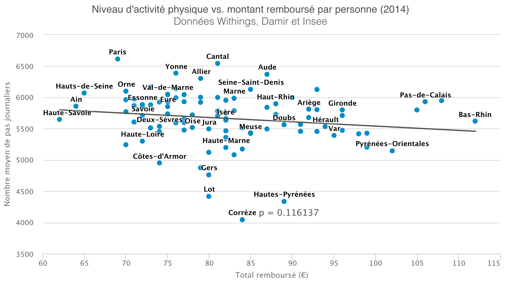
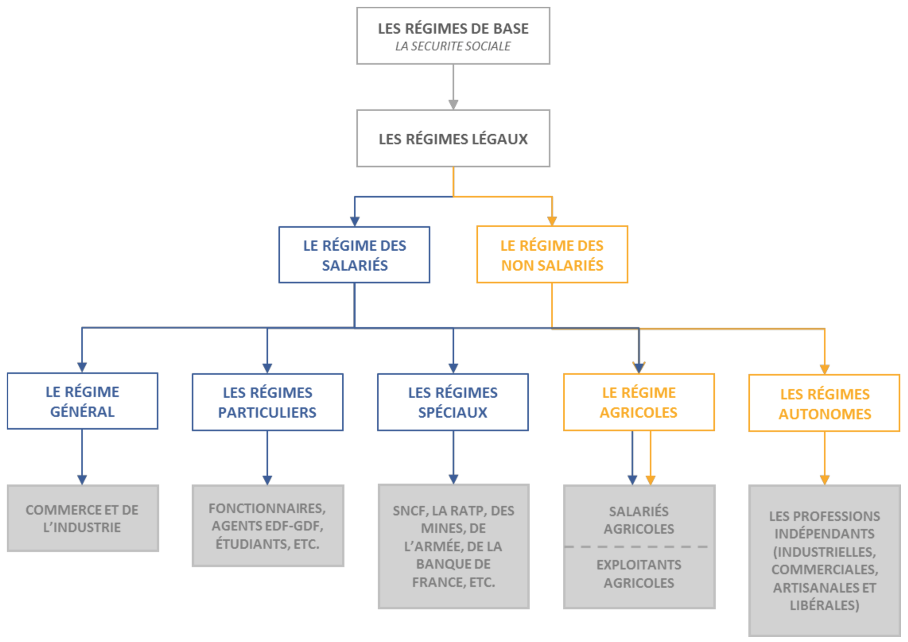

# 2.1. La situation française

## 2.1.1. Vis-à-vis de l'open data

### a. Historique de l’ouverture des données

Les premières notions d’ouverture et de transparence apparaissent dans le document fondateur de notre société : la Déclaration des Droits de l’Homme et du Citoyen de 1789.

Celle-ci énonce :

« *Art. 15. La Société a le droit de demander compte à tout Agent public de son administration. L’intérêt de cet article réside dans le fait de comprendre comment l'administration prend ses décisions et l'usage qu'elle fait des ressources qui lui sont confiées.* »


Depuis 1978, les différentes versions de la loi Informatique et libertés, notamment à l’origine de la création de la CNIL, ont mis en place la Commission d’Accès aux Documents Administratifs (CADA)31. Cette autorité administrative indépendante peut intervenir au besoin lorsqu’un particulier ou une organisation voit sa requête de consultation d’un document refusée par l’une des administrations. La CADA étudie la demande qui a été rejetée puis rend compte d’un avis positif ou négatif sur une éventuelle diffusion.

Elle a récemment rendu un avis opposé à celui de la Direction Générale des Finances Publiques (DGFIP). En effet, cette administration avait rejeté la demande d’ouverture des codes sources du logiciel simulant le calcul de l’impôt sur le revenu32. Il est à noter qu’à ce jour, l’avis de la CADA n’a pas été suivi d’actions de la part de la DGFIP.

Enfin en 2015, des travaux législatifs ont été évoqués à l’assemblée nationale sur l’ouverture des données de transport33 ainsi que sur les données de santé.

### b. Caractéristiques de l’open data

L'open data n’existe que sous la forme d’un écosystème. Il nécessite la combinaison d’au moins trois types d’acteurs :

- L’**émetteur de données** : chargé du recueil des données puis de les rendre publiques.
- Le **réutilisateur** : chargé du développement des (nouveaux) services, de répondre à un besoin via ces données ouvertes.
- Le **consommateur** : c’est le bénéficiaire des nouveaux usages permis par le réutilisateur.

### c. Données publiques, ouvertes, gratuites et libres

Beaucoup de notions interviennent lorsque l’on aborde le sujet d’ouverture des données ; il est important d’éclaircir l’ensemble de ces termes.
Tout d’abord, les **données publiques** sont celles qui proviennent d’entités publiques (d’une administration avec une mission de service public). En opposition aux **données privées**, qui sont celles émanant des sociétés privées.

Les **données ouvertes** désignent simplement les jeux de données qui sont diffusés. Cette notion n’est pas traduite juridiquement à l’heure actuelle. Elles peuvent désigner tout secteur, tout type d’informations et figurer dans tout type de formats (XML, texte, formats d’images...).

**Open data ne signifit pas gratuité**. Des données gratuites sont des données que le fournisseur a choisi de partager sans aucune contrepartie financière des utilisateurs. D’autres données sont mises à disposition à condition d’y mettre la main à la poche. Au moins deux modèles de financement sont identifiés : le premier consiste à **indexer le prix sur la consommation** avec un paiement au nombre de requêtes faisant appel au web service. Le second est un **système de redevance**, souvent utilisé lorsque la mise à disposition nécessite une étape d’anonymisation du jeu de données.

Enfin la **réutilisation** qui est un point crucial, est généralement déterminée par la licence délivrée avec les données. La majorité des données de l’administration sont sous « Licence Ouverte » conçue par Etalab. L’autre licence très utilisée est l’« Open Database License ». Ces licences ont bien sûr la capacité d’être adaptées par le réutilisateur.

En résumé, un véritable open data peut autant concerner des données publiques que privées. Les données qui sont ouvertes sont préférablement gratuites et sous licence libre dans son texte initial.
Tandis que l’open data santé – tel qu’il est mis en œuvre par les institutions de protection sociale / santé à ce jour – ouvre une petite partie des données publiques, utilise parfois le système de redevance et n’intègre aucune homogénéité ni dans le format des données distribuées, ni dans la licence employée.

### d. Initiatives d’ouverture des données

#### Plateformes publiques

En France, quelques initiatives d’ouvertures de données de santé existent :

| Intitulé de la plateforme | Description | Objectif |
| :-----------: | :---------------------- |:---------|
| [Transparence.sante.gouv.fr](http://www.transparence.sante.gouv.fr) | Plateforme rendant public les montants versés et déclarés par les entreprises aux acteurs de la santé (*professionnels de santé, établissements de santé, éditeurs de logiciels de santé...*). | Éclairer le grand public sur les liens d'intérêt entretenus par les entreprises avec les PS. |
| [Scopesante.fr](http://www.scopesante.fr)|Plateforme publique de visualisation de données sur la qualité des établissements de santé. La représentation des données est ici, excellemment bien réalisée mais les données n’y sont pas accessibles.|clairer le grand public sur la qualité de certains services des établissements de santé.|
| [ScanSante.fr](http://www.scansante.fr)|Catalogue de restitution de données agrégées (pour le grand public) de santé à travers divers thématiques: activités médicales, finances, pertinence, performance, ressources humaines. Les données sont accessibles sous la forme de requêtes pré- paramétrées, selon le profil de l’utilisateur.|Restituer au grand public ainsi qu’aux professionnels, des données sur l’information hospitalière complète.|

Ces plateformes ne peuvent être qualifiées de véritable open data. Car même s’il s’agit de premiers pas significatifs, cela n’est pas suffisant pour au moins trois raisons, principalement liées à l’exploitabilité limitée de ces informations :

- impossibilité d’extraire simplement la masse de données pour les réutiliser librement,
- données accessibles parfois sous condition d’être identifié,
- enfin, ce sont des plateformes plutôt confidentielles et qui sont dispersées.

##### Évolution de ces plateformes publiques

24/05/2016 - Le contenu brut (données csv) de la plateforme **Transparence Santé** a été publié sur le site [data.gouv.fr](https://www.data.gouv.fr/fr/datasets/transparence-sante-1/). 
Aucune réutilisation de ce jeu de données n'a encore été publiée. 


#### Hackathon

Le hackathon est un autre genre d’initiative qui existe depuis peu en France. Il s’agit d’événements collaboratifs de programmation centrés sur des thématiques précises. Cette démarche est de plus en plus populaire qu’il s’agisse d’intérêts publics ou privés.

La CNAMTS a organisé son premier hackathon en 2015. Cet événement, centré sur les dépenses de santé du DAMIR, a permis de réunir des professionnels de l’assurance maladie, des statisticiens et des informaticiens autour de ce jeu de données (consulter les annexes 1 et 2).

L’un des objectifs de l’événement a été de mesurer la capacité du public à appréhender un tel jeu de donnée en une journée. Parmi les principales missions confiées aux acteurs présents, nous retrouvons :

- L’évaluation du risque de ré-identification des professionnels de santé ou assurés.
Ce groupe de travail sur la ré-identification, constitué d’experts, n’est pas parvenu à ré-identifier des candidats via le jeu de données transmis.
- La corrélation entre l’offre de soins et la pratique des dépassements d’honoraires.
- Quelle concordance entre les données de l’assurance maladie et les données de santé remontées par les objets connectés ?
Cette question menée par Withing a permis de croiser les données de l’assurance maladie avec celles constatées sur les usagers de traqueurs d’activité Withing et d’en tirer la conclusion suivante : « *plus les gens sont actifs, moins ils sont consommateurs de soins de santé* ».


*Mise en évidence de l’existence d’une relation entre les dépenses de santé et le niveau d’activité physique. Source : http://blog.withings.com/fr/2015/01/30/withings-participe-au-hackathon-lassurance-maladie-etalab*

La démarche du hackathon permet à l’organisateur, à moindre frais :

- de percevoir l’intérêt des participants envers les données,
- de se rendre compte de la justesse de position des données en termes de granularité ou de complexité des données.

Attention à ne pas opérer le raccourci d’un open data seulement exploitable à travers ces événements éphémères et non-rémunérés. Des événements plus réguliers et suivis doivent être privilégiés pour la création d’un écosystème vivant.
## 2.1.2. L'assurance maladie et ses missions

*Les institutions la protection sociale en France. Source : www.musee-assurance-maladie.fr*

Pour répondre à la problématique posée dans ce mémoire, il est important d’expliciter les cinq orientations principales qui guident l’action de l’assurance maladie :

- Le **développement de la prévention** pour contenir la dépense des soins, c'est-à-dire agir sur le comportement avant l'apparition de pathologies.
- **L'information** et **l'accompagnement de tous les acteurs du système**, en particulier les assurés et les professionnels de santé.
- La **limitation des dépenses** inutiles par le contrôle du périmètre des soins pris en charge, la fixation des tarifs et la justification médicale du recours aux soins.
- L'**organisation** de l'offre de soins.
- Le **pilotage et le contrôle** du système de soins.

Pour mener à bien ces grands axes stratégiques, les organismes d’assurance maladie signent une *Convention d’Objectifs et de Gestion* (COG) avec l’État. C’est au sein de ce type de documents que l’on retrouve les axes prioritaires qui donneront lieu à l’élaboration des chantiers pour la période à venir.

## 2.1.3. Les événements annoncés ou réalisés

### a. Convention d’objectifs et de gestion

Ce document est le fondement des axes stratégiques de l’assurance maladie pour une période de trois années. Les thèmes abordés y sont diffus et variés, mais sa position de document cadre entre l’État et l’assurance maladie (ici, la COG CNAMTS) permet à tous, de saisir les enjeux de l’assurance maladie de demain.

Voici quelques engagements tirés de la COG actuelle :

| Fiche n°14 - Mieux connaître le système de santé et promouvoir ses transformations |
| :----------------------------------|
| Promouvoir l’enrichissement des données du SNIIRAM et mettre en œuvre les décisions des pouvoirs publics relatives à l’ouverture des données de santé |
| Promouvoir une meilleure connaissance des parcours et du système de soins et réaliser des études de santé publique |

| Fiche n°20 - Favoriser l’adaptation du système d’information aux objectifs stratégiques de la COG |
| :----------------------------------|
| Faire évoluer la gestion des bases de données pour individualiser le service rendu aux assurés sociaux et à leurs ayants-droits |

Ces fiches vont dans le sens d’une ouverture des données de santé par l’assurance maladie.

### b. Partenariat avec l’école Polytechnique

Ce partenariat de recherche et développement d’une durée de trois ans avec l’*X* a pour objectif de favoriser le développement des technologies du big data appliqué au domaine de la santé (voir l’annexe 3 pour le communiqué de presse). Cette collaboration a pour ambition de déployer de nouvelles pistes d’exploitations des données du Système National Inter Régimes de l’Assurance Maladie.
Cette association signale le vif intérêt porté par l’assurance maladie envers l’exploitation de ses données médico-administratives.

Cette collaboration avec une école prestigieuse montre l’intérêt certain, et surtout l’existence d’un vrai besoin de l’assurance maladie en science des données.

### c. Adoption de la loi « open data »

C’est pendant la rédaction de ce mémoire, le 10 avril 2015, qu’a été votée la loi dite « open data » (Loi de Modernisation de notre système de santé — Article 47). Elle projette la création d’un Système National des Données de Santé (SNDS) dédié entièrement à l’open data. La création de cette instance n’a toujours pas été initiée (ce dernier point sera évoqué dans la suite du mémoire).
Il s’agit toutefois d’une information importante, étant donné qu’elle rend réelle la possibilité de création d’une instance en charge des données de santé ouvertes.

### d. L’avènement des applications de prévention publiques

La prévention est un objectif majeur pour l’assurance maladie. Cette activité est déjà représentée par des applications gratuites comme Sophia, PRADO ou encore Santé Active. Ces programmes de suivi personnalisé reposent entièrement sur la connaissance de l’individu assuré et utilisateur du service. Cela vient donc instaurer un nouveau rapport entre le bénéficiaire et ses propres données personnelles : les confier, accepter un traitement par des algorithmes non-connus pour en retirer un avantage.
Même s’il ne s’agit pas d’ouvrir ces données (à caractère personnel), il est important de noter qu’une fois de plus, **la donnée de l’individu est la matière première pour proposer de nouveaux services à forte valeur ajoutée à l’assuré**.
