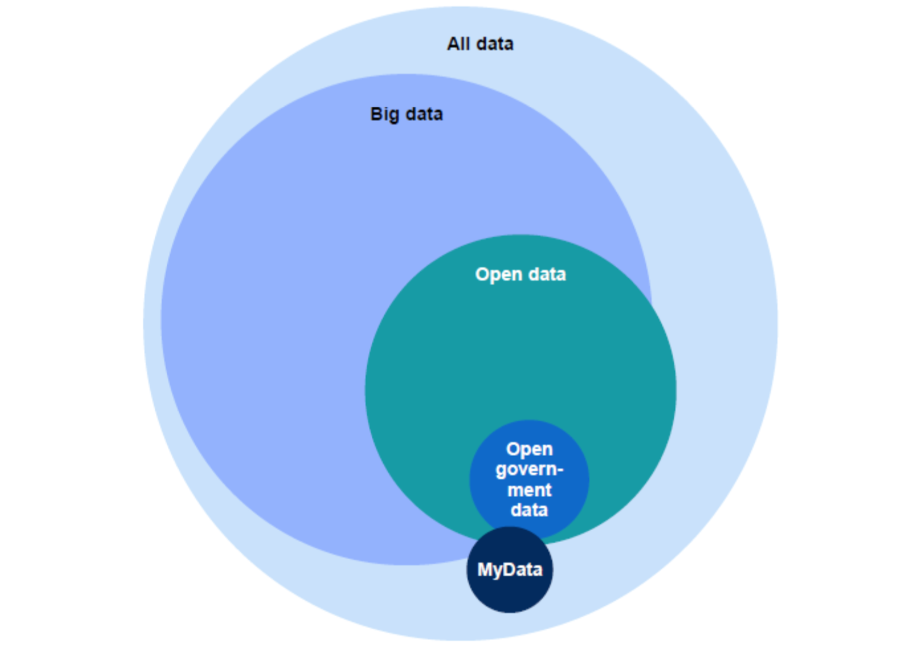
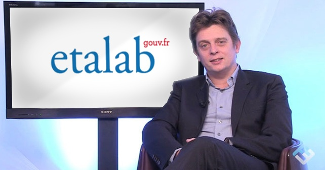
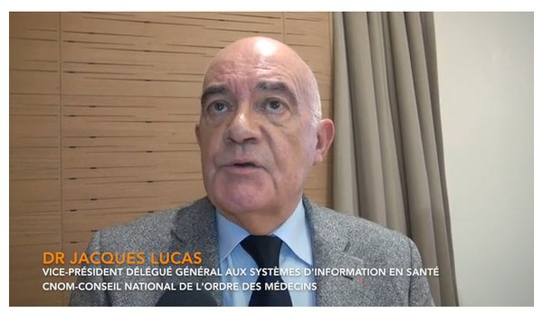
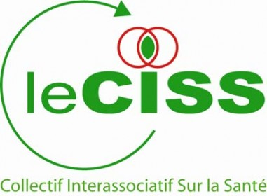

# 2.4. La transition numérique et l'open data santé

Comme cela est évoqué dans la première partie de ce mémoire, de nouvelles étapes ont été franchies depuis une quinzaine d’années vis-à-vis des données de santé.

Parallèlement au secteur spécifique de la santé, le gouvernement, un ensemble de professionnels, les patients et des entrepreneurs semblent avoir pris conscience qu’une nouvelle ère numérique se présente.

À l’image de la révolution industrielle au XIXème siècle, beaucoup d’acteurs pensent avoir affaire à une nouvelle révolution marquante : la transition numérique. 

Les chapitres qui suivent s’appliquent à décrire les moyens techniques mais aussi à expliciter les volontés qui accompagnent cette émergence du numérique au sein de la sphère publique ainsi que celle de la santé et qui permettent d’identifier ce changement de paradigme.

## 2.4.1. Dynamique technologique

Bien qu’entretenant un lien fort avec l’innovation, le Secteur Public reste parfois timide face à l’utilisation des nouvelles technologies et cela pour deux raisons principales.

- L’**efficience**, la technologie doit pouvoir répondre à des critères qualitatifs.

	- Capacité à être mutualisée entre différents services.
	- Capacité à répondre à l’ensemble des besoins en termes de fonctionnalités. 
	- Robustesse de la technologie.
- Le coût, la technologie doit être abordable et disposer d’un rapport qualité prix justifié.

Malgré ces contraintes, l’AM possède quelques références récentes qui pourraient jouer un rôle dans l’adoption d’un open data santé. Ci-dessous figurent quelques-uns des grands projets CNAMTS dont Sopra Steria est le prestataire.

### a. Bus de services

Cette technique est au cœur de l’organisation du S.I. de la CNAMTS. Le bus consiste en la mise à disposition d’un bouquet de services permettant le routage, afin que les applications puissent accéder aux informations d’un individu de façon fiable et homogène. Le bus de services garanti également un couplage lâche entre consommateurs et fournisseurs de services.


Il vise notamment à fournir :

- une **exposition de services**, à travers l’usage des web services :
	- pour gérer la notion de versions de service et accepter la cohabitation de plusieurs versions (rendues nécessaire par la mutualisation des services et par l’ouverture du SI de l’assurance maladie),
	- pour gérer l’autorisation d’accès au service des différentes applications clientes. 

- un **annuaire de service** :
	- associé à une fonction de routage permettant d’accéder de manière fiable aux services métiers « localisés »,
	- pour répondre au besoin d’un catalogue de service stockant tous les éléments réutilisables et permettant de cartographier l’existant « services » de l’organisation.

Nous pourrions transposer ce principe d’exposition de services à destination des réutilisateurs de l’offre open data de l’assurance maladie.

### b. Business Process Management (BPM)

Le BPM est une nouveauté au sein de la CNAMTS depuis 2015. Il a essentiellement deux vocations :

- **Modéliser** : la modélisation BPM permet de représenter dans un langage standard, l’ensemble des workflows associés aux métiers des agents du régime général,
- **Permettre d’optimiser** : une évaluation des performances du S.I. est de vigueur après la modélisation. Il convient d’analyser l’ensemble des processus métiers pour ensuite les restructurer de manière optimale. Ces processus peuvent être strictement informatique ou non.

À termes, l’objectif est d’y inscrire les 83 métiers du régime général.

Rapporté à la stratégie d’ouverture des données de l’AM, le BPM pourrait contribuer à élaborer un système optimal quant aux workflows de gouvernance, d’acquisition et de partage des données.

### c. Technologies big data

Chaque année un Objectif National des Dépenses d’Assurance Maladie (ONDAM) est voté pour indiquer le montant prévisionnel des dépenses de l’assurance maladie en France. À ce titre, l’AM a pour objectif de réduire certains postes de dépenses comme ceux que représentent la fraude, ou encore la consommation de soins pour les maladies chroniques. À ce jour, le décisionnel est très utilisé mais les résultats de son exploitation sont très limités.

C’est donc ici que viennent se positionner les technologies de type big data :

- **Volume** – la quantité de données qui peut être traitée est de l’ordre du téraoctet,
- **Variété** – les données proviennent de sources multiples et d’une très grande diversité,
- **Vélocité** – il s’agit d’exploiter ces volumes importants et variés de données dans des métriques proches du temps réel.

Ces nouvelles technologies permettent d’appliquer des techniques de data mining, d’apprentissage artificiel sur les données stockées.

Pour situer l’intérêt de l’open data vis-à-vis du big data, le cabinet McKinsey a produit l’illustration suivante où :

- l’ouverture des données est (ou peut être) à la source de travaux en big data,
- le cabinet de conseil représente également l’open data comme un domaine à périmètre variable.


*Positionnement de l’open data vis-à-vis des autres types de données. Source : McKinsey Global Institute analysis)*

Ces initiatives sont encore au stade de preuve de concept (POC), mais la présence de dirigeants ou d’employés de la CNAMTS lors d’événements big data traduit cet intérêt particulier envers ces technologies.

## 2.4.2. De multiples orientations

La présentation de personnalités ci-dessous n’est pas exhaustive mais il est intéressant de constater l’investissement, le type d’actions et la hauteur d’impact des acteurs qui font le numérique de demain en France.

###a. Secrétaire d'État à la Réforme de l'État et à la Simplification (SGMAP)

Créé en 2012 pour piloter et mettre en œuvre la stratégie numérique de l’État, cette structure interministérielle est placée sous l'autorité du Premier ministre.

Sa mission générale est de permettre à l’action publique de s’adapter « aux défis et aux évolutions posées par la révolution numérique ». Elle se décrit également comme un laboratoire et comme promotrice de l’innovation publique.
Elle a aussi la particularité d’adopter un mode de communication dans l’ère du temps^63. Le SGMAP symbolise le mouvement entreprit par l’État pour se réformer.


Le SGMAP est la fusion de trois entités :

- la **Direction générale** à la modernisation de l'État (DGMAP),
- la **Direction interministérielle** des systèmes d'information et de communication^64 – la Disic, qui est la DSI de l'État et,
- **Etalab**, que dirige Henri Verdier.
L'open data dans l’administration a véritablement bénéficié de l’engagement des plus hautes instances de l’État. Ces dernières ont permis depuis 2012 de faire progresser la démarche : le nombre de données accessibles a augmenté, la gratuité de certaines données a été obtenue, une simplification des conditions de réutilisation a été mise en place.

En 2016, le SGMAP comprend deux directions (le décret associé est disponible sur [legifrance.gouv.fr](https://www.legifrance.gouv.fr/affichTexte.do;jsessionid=9E5110F3A37CED69EF2D3928B390F471.tpdila19v_2?cidTexte=JORFTEXT000031194412&dateTexte=&oldAction=rechJO&categorieLien=id&idJO=JORFCONT000031194407).) :

- DIAT, la Direction Interministérielle pour l'Accompagnement des Transformations publiques, 
- DINSI, la Direction Interministérielle du Numérique et du Système d'Information et de Communication de l'Etat.


###b. Administrateur des données



La France a été le premier pays au monde à créer le poste d'**Administrateur Général des Données (AGD)** – ou Chief Data Officer (CDO).
Ce poste est confié à Henri Verdier dans le cadre de la mission Etalab : le service chargé de l'ouverture des données publiques et du développement de la plateforme française open data.

Son niveau de décision est établi par le décret évoquant la création de la mission. Ce décret lui confère les autorisations d’engagement et les pouvoirs nécessaires pour lui permettre de s’impliquer, à travers l’ensemble des ministères, dans les politiques de production des données clés.

Le périmètre d’action d’Etalab ainsi que la création du poste de directeur des données ont donc un rôle moteur dans la stratégie d’ouverture entreprise par le gouvernement français.

###c. Professionnels de santé



Le Conseil National de l’Ordre des Médecin (CNOM) reste pragmatique face à l’ouverture des données de santé. À propos des données du SNIIRAM sur l’offre et remboursement de soins, le Dr. Jacques LUCAS vice-président du CNOM affirme :

> « À partir du moment où ces données sont strictement anonymisées, sans permettre une ré- identification de la personne par des croisements multiples, la démocratie sanitaire voudrait que toutes les organisations et instances représentatives puissent avoir accès à ces données. » 

Le CNOM est favorable à l’élaboration d’un débat global qui impliquerait l’ensemble des acteurs :

> « L’organisation de ce débat devrait faire appel aux instances ordinales, au Comité consultatif national d’éthique, à la Cnil, aux administrations centrales des ministères concernés, aux industriels et aux citoyens, via les associations d’usagers. »

###d. Patients



Le Collectif Interassociatif Sur la Santé (CISS) regroupe 40 associations diverses, toutes issues du monde de la santé. Il représente et défend les intérêts communs à tous les usagers du système de santé.

De manière générale, le collectif encourage l’implication des usagers dans les décisions, individuelles ou collectives, qui les concernent.

Son positionnement vis-à-vis de l’ouverture des données est le suivant : il est nécessaire de permettre aux usagers du système de santé d’accéder aux données de santé.

Ci-dessous figure un extrait de communiqué de presse du CISS :

> «Les organisations non gouvernementales n’ont pas d’accès effectif aux données de santé anonymisées. Alors que l’Open Data progresse dans l’environnement, les transports et dans les collectivités locales, nous restons à la traîne dans le domaine de la santé alors que les enjeux sont colossaux [...]. Les pouvoirs publics doivent nous assurer les moyens d’une utilisation de ces données, pour mettre fin à cet entre soi institutionnel de l’accès aux données publiques qui joue contre les citoyens et, plus globalement, contre l’organisation éclairée de notre système de santé. »

###e. Entrepreneurs

#### Benoît THIEULIN (Entrepreneur avec Netscouade, Président du Conseil National du Numérique 2013-2016)


Le Conseil National du Numérique est un organisme consultatif indépendant créé en 2011 et constitué de trente membres tous bénévoles. Ses derniers travaux sont les 70 propositions contenues dans le rapport « Ambition Numérique » et présentées au Premier ministre ainsi qu’au ministre du numérique.
La restitution du rapport, au mois de juillet 2015 après six mois de concertation citoyenne, vise à alimenter à la fois la stratégie numérique du Gouvernement et le projet de loi sur le numérique.

La diffusion de l’open data est fortement présente parmi les propositions, qu’il soit « généraliste » ou « santé » :

##### Donner une nouvelle ambition à la stratégie d’ouverture des données publiques|a

N° | Résumé
-- | --
26 | Opter pour une ouverture par défaut des données publiques, avec un objectif général de gratuité
27 | Favoriser le développement et la coordination des stratégies d’ouverture des données publiques
28 | Repenser le droit d’accès aux documents administratifs, dans le contexte d’ouverture des données publiques
29 | Encourager au cas par cas le partage de données des acteurs économiques et de la société civile, en veillant au respect des droits fondamentaux et à l’équilibre des intérêts des parties prenantes

##### Santé et numérique
N° | Résumé
-- | --
60 | Acter et outiller un droit à l’autodétermination informationnelle en santé
61 | Inciter au cas par cas les acteurs économiques détenteurs de données de santé à les partager tout en tenant compte de leur caractère concurrentiel
62| Utiliser le levier numérique pour permettre au grand public de comprendre les défis de santé publique et de devenir acteurs de leur résolution
63 | Former les professionnels de santé aux enjeux et aux usages du numérique en santé

Ces propositions concernant « Santé et numérique » sans relever directement de l’open data y sont liées : l’autodétermination informationnelle ou « self-data » évoque le fait de disposer de « ses » données, pour possiblement les réutiliser à travers des applications tierces ensuite. De même, la prise de conscience des défis de santé publique par le grand public peut être amenée via l’ouverture des données de santé.

Cet ensemble de personnalités, mais surtout de citoyens, pratiquent un lobbysme autour du numérique et de l’open data, à travers différents médias et sous différentes formes pour tenter de convaincre l’opinion publique et les dirigeants. D’autres noms auraient pu être cités, parmi lesquels Gilles BABINET, entrepreneur avec Captain Dash et Digital Champion France auprès de la commission européenne. Ou encore Bernard STIEGLER, directeur de l’Institut de recherche et d'innovation, qui a déclaré à propos de l’open data en général :

> « C’est un événement d’une ampleur comparable à l’apparition de l’alphabet. »

###f. Philosophes

####Eric Verhaeghe (Énarque, étude de la philosophie, écrivain, ancien président de l’APEC)

Il est intervenu au colloque Big Data / Santé Publique. Lors de cet événement, ce dernier a tout d’abord évoqué l’importance de transparence pour l’existence du débat (principe relatif à l’éthique de la discussion d’Habermas) ; la doctrine selon laquelle le débat public doit s’organiser autour d’une délibération vertueuse, le partage des savoirs avec tous les acteurs du débat public et cela pour forger un sens commun. L’intérêt d’engendrer une collaboration sincère entre tous les acteurs.
Eric Verhaeghe défend également la libre et gratuite réalisation de ces données publiques, droit fondamental non respecté actuellement avec l’existence de redevances.

## 2.4.3. La transition numérique appliquée au secteur de la sante

Selon le cabinet McKinsey, la transition numérique se caractérise selon les cinq axes suivants. Voyons son application au secteur particulier de la santé.

###a. L’enrichissement de l’expérience utilisateur / bénéficiaire / patient

Toujours concernant les services qui sont déployés à l’attention des utilisateurs, l’enrichissement de son expérience utilisateur est apporté par de meilleures interactions entre les clients d’un service et le fournisseur. Ces nouvelles interactions sont plus précises et présentées dans un contexte plus opportun : nous parlons de l’information omni-canal.

L’omni-canal permet en définitive au fournisseur d’être présent partout et de tenir le même message, le même discours, qu’il s’agisse du support ou du lieu géographique.

Dans le domaine de la santé, par exemple dans le cadre d’un parcours incluant de l’ambulatoire, il est aisé d’imaginer un meilleur suivi et une meilleure information en tout lieu sur le parcours de soin de l’individu.

###b. Innovation des produits et des services

Cet axe est l’un des axes majeurs du concept de la révolution numérique. Il fait intervenir la notion d’innovation dans les produits, mais surtout les services, qui connaissent une véritable révolution à l’ère numérique. Nous pouvons simplement citer le cas de l’entreprise de VTC Uber, qui entraine un bouleversement : dans l’ensemble de la profession de chauffeur, dans la législation et la consommation grâce à l’innovation de rupture qu’elle apporte. Ce phénomène a été constaté sur différents secteurs d’activité, on parle d’uberisation.

Il est vrai que ces innovations sont plutôt concentrées sur des technologies relativement récentes, et permettent très souvent de proposer un service très personnalisé. Nous pouvons le constater avec les activités des start-up santé issues de la pépinière Paris Santé Cochin : CalMedica, deuxièmeavis.fr...

Enfin, l’open data peut être à l’initiative de nombreuses de ces innovations puisqu’**il met à disposition de tous, des informations auxquelles peu ou personne n’a pu accéder** auparavant. Et donc in fine, offre de nouveaux horizons propices à la création et à l’innovation.

###c. Décisions mieux éclairées

Cette constatation émergeante de la transition numérique et permise par les technologies est valable à la fois pour le fournisseur de service mais aussi pour le consommateur dudit service. La multiplication des canaux de communication et le traitement plus poussé de l’information conduisent à prendre, pour chacun des acteurs, des décisions mieux analysées donc plus sûres.

Rapporté exclusivement à la santé, d’une part il peut être attendu du professionnel de santé un meilleur choix grâce à sa meilleure connaissance de l’état du patient.
D’autre part, en tant que citoyens, nous pouvons attendre des décisions en termes de politiques de santé publique qu’elles soient alimentées par des éléments factuels, transparents et connus de tous.

###d. Transformation numérique des processus

La situation économique impose à la quasi-totalité des directions des organisations, informatiques ou non et y compris dans le domaine de la santé, une réduction des charges récurrentes (OPEX). À cette fin, ce sont encore une fois les technologies qui sont le moteurs de ce nouveau positionnement envers les processus internes de l’organisation (production, administratif, ressources humaines...).

Le cloud computing fait par exemple partie de ce qu’on appelle le lean IT, qui est une extension des principes du lean et qui offre la possibilité d’optimiser ces types de budgets.

###e. Transparence sur la qualité et la performance

Qu’il s’agisse des structures de soin (médecins, établissements...) ou bien de points d’information de l’assurance maladie (Espace Santé Active, Caisse Primaire...), chaque service distribué est en mesure d’être évalué et communiquer ensuite sous diverses formes pour justifier ou auditer un fonctionnement efficient de la structure.

Sur cet aspect de transparence, la démocratisation de nouvelles technologies conjuguées à l’open data ont un rôle majeur à jouer dans une démarche de benchmark et permettre à quiconque d’évaluer les services fournis selon des critères libres.

## 2.4.4. Nouvelles tendances adoptées

Le secteur de la protection sociale est inévitablement lié à celui de la santé, preuve en est avec le transfert du Dossier Médical Partagé (DMP) sous le giron de la CNAMTS. Le modèle français de partage du risque impose à l’assurance maladie d’être bien sûr partie prenante dans le remboursement, mais aussi en amont dans l’organisation du parcours de soin.

Pour cela, de nouvelles pratiques sont mises à l’épreuve ou adoptées afin d’impacter le remboursement de la maladie :

- L’accompagnement et le coaching, 
- La médecine préventive,
- Etc.

Ces pratiques tirent parties des nouvelles technologies et nouveaux concepts sociaux. Elles laissent percevoir qu’un changement est en train de se produire : l’assurance maladie tend à être un acteur de plus en plus investit dans la vie des individus, et dont les lignes du périmètre initial ont été repoussées.