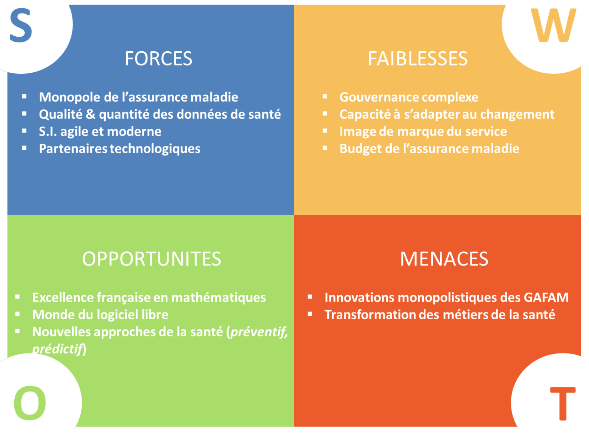
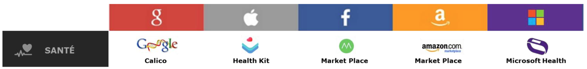

# 3.1. Convictions

## 3.1.1. SWOT
La matrice SWOT (Strenghts, Weaknesses, Threats, Opportunities) ci-dessous est orientée autour du projet d’ouverture des données de santé. Il présente de manière synthétique les forces et les faiblesses de l’assurance maladie. Ainsi que les opportunités et les menaces qui pèsent sur elle quant à l’initiative d’un tel projet.

## 3.1.2. Perspectives entrainées par l'utilisation des données de santé

### a. Des usages déjà concrets

Les Google, Apple, Facebook, Amazon, Microsoft (GAFAM) n’ont pas attendu l’ouverture des données pour commencer à constituer leurs propres bases de données de santé.

Chacune d’elle est positionnée sur le secteur via une filiale ou un produit

Grâce à ces produits ou services, ces entreprises commencent à capter des données, à les réutiliser, à élaborer de nouveaux services et à poursuivre de nouvelles recherches.
Les sous-parties suivantes détaillent quelques usages existants.

#### Réutilisations – Aurora Health Care

Aux États-Unis, les hôpitaux les moins efficaces sur l’indicateur de réadmission des patients sont moins remboursés par l’assurance maladie.

En considérant cela, le **réseau d’hôpital Aurora Health Care** a décidé d’agir en exploitant l’ensemble des données de santé à sa disposition. Grâce à l’analyse des données, Aurora Health Care est parvenue à adapter le traitement de ses patients, et d’ajuster leur sortie en conséquence. Ainsi, ces pratiques ont permis à ce réseau d’hôpitaux de réduire de 10% les réadmissions et de générer une économie de 6 millions de dollars.

#### Nouveaux services – IBM, Watson

En 2006, l’entreprise IBM a créé **Watson**. C’est un programme d'informatique cognitif capable, entre autre, d’acquérir beaucoup d’informations et de les mobiliser pour répondre à des questions. Il s'agit du programme d'intelligence artificiel le plus avancé en 2015. La machine est célèbre pour avoir gagné le jeu Jeopardy aux États-Unis ; ce jeu consiste à apporter la question à une réponse donnée.
Cette exploitation est transposable au domaine de la santé : quel traitement correspond le mieux pour une maladie diagnostiquée ?

Avec Watson Healthcare, IBM accompagne le New York Genome Center dans le cadre des maladies du cancer résultant de mutations génétiques spécifiques. La machine d’IBM apporte une aide à la décision aux médecins, en déterminant les avantages et inconvénients de chaque traitement. Elle peut trouver dans les bases de données génomiques et dans la littérature médicale, des références sur les mutations identifiées chez les patients. Le supercalculateur communique alors toute information pertinente au médecin.

Outre cette nouvelle capacité à apprendre, la machine peut "comprendre" le langage naturel et par-dessus cela, apercevoir l'invisible à l’œil humain sur une image médicale.
À terme, IBM ambitionne de faire de Watson un outil indispensable au domaine de la santé.

> Pour aller plus loin sur Watson, je recommande l'excellent billet sur l'IA par O.Ezratti, notamment le billet #3 de la série sur [les avancées de l’intelligence artificielle](http://www.oezratty.net/wordpress/2016/avancees-intelligence-artificielle-3/).

#### Nouvelles recherches – Alphabet, 23andMe & Calico

23andMe et Calico sont des filiales d’Aphabet (ex-Google).

**23andMe** est une société de biotechnologie qui propose aux particuliers de comprendre leur propre information génétique par le biais de technologies d'analyse de l'ADN et d'outils interactifs sur le Web. Cette collecte de centaines d’échantillons vise à alimenter ses travaux de séquençage d’ADN, et plus précisément les recherches sur la maladie de parkinson affectant l’un des fondateurs de Google, Sergey Brin.

**Calico** est aussi une société de biotechnologie. Il s’agit en fait d’un laboratoire de recherche ayant pour objectif de stopper le vieillissement. Un partenariat avec la plus grande société américaine de généalogie80 (Ancestry.com) vient d’être passé dans le but de séquencer un million d’ADN. L’objectif est « de découvrir les gênes qui favorisent la longévité ».

En résumé, tous ces usages résultent d’expertises en sciences de la donnée. La donnée de santé est centrale dans les innovations de la nouvelle économie.

### b. L’importance des data sciences

À l’image du charbon lors de la révolution industrielle, les données doivent être considérées comme une matière première. Les données de santé ouvertes, seules, sans méthodes ni outils ne sont d’aucune utilité.
C’est le scientifique de la donnée (data scientist) qui va permettre de faire émerger, à partir de données brutes, une nouvelle valeur ajoutée. Cette science de la donnée (data science) repose essentiellement sur deux fondements (en plus des données).

D’abord les **modèles mathématiques avancés** (apprentissage artificiel, data mining...). La ressource mathématique est nécessaire pour d’une part permettre d’appliquer ces modèles et d’autre part, pour procéder à leur validation.
Cette exploitation mathématique automatisée est accessible seulement depuis les années 2000, notamment grâce à l’émergence de certains **logiciels et systèmes de bases de données libres**.

Cette rupture amenée par la communauté du libre se caractérise par : l’accès, pour tous, à des outils permettant le traitement des données de masse.
Cette émergence conjuguée aux techniques mathématiques participe à l’élaboration d’une rupture technologique.


L’ouverture des données associée aux sciences de la donnée génère des **données intelligentes**.
Ces données intelligentes induisent de nouvelles perspectives pour les organisations :


- La création de **nouveaux champs d’analyse**, à travers le croisement de jeux de données d’univers différents. Provenant d’entreprises, d’associations, de ministères...
- La réalisation de **traitements prédictifs nouveaux** : accélération de la R&D, gestion des médicaments, des RH, des patients, des comportements. Tout cela aussi bien dans une dimension collective qu’individuelle.

### c. Transformation de la santé publique

L’ouverture des données de santé offre de véritables opportunités pour transformer la santé publique.

#### L’organisation de missions de recherche analytique

La Haute Autorité de Santé (HAS) est dotée d’une mission générale de contribution à la régulation du système de santé par l’amélioration de la qualité en santé, et l'efficience.
Elle évalue d’un point de vue médical et économique les produits, les actes ou encore les prestations. Elle définit des recommandations de bonne pratique clinique, de santé publique, des études médico- économiques, des guides de prise en charge, à destination des professionnels et des patients. Et rend également des avis dans le cadre de sa mission d’aide à la décision des pouvoirs publics.

L’ouverture des données de santé nous permet d’imaginer que des organisations (associations de patients, de professionnels de santé, entreprises) exploitent ce vivier de données. Et qu’à l’aide de méthodes d’analyse transparentes contribuent, comme l’HAS, à l’élaboration d’évaluations, de recommandations ou d’avis dans le cadre d’études qui seraient requises par les pouvoirs publics.

#### Dépasser l’approche curative

Le système de soins français est orienté vers le « curatif ». C’est-à-dire que l’apport de soins est réalisé a postériori, lorsque l’affection est déjà présente chez le patient. Mais d’autres approches existent et visent à positionner le système de soins en amont de ce traitement curatif.
Ces approches qui tirent partis du numérique et des data sciences vont être à l’origine de nombreux changements : bouleversements organisationnels du système de soins, des métiers du sachant en santé, etc.

L’idée est de prévenir avant de guérir. Passer d’un système de soins curatif vers un système de soins **préventif**, c’est la transition opérée actuellement par le système de soins, mais aussi par les acteurs technologiques. Par exemple, l’Apple Watch notifie l’utilisateur lorsqu’il est nécessaire qu’il se lève de sa chaise (prévention des risques liés au comportement d’immobilité).
Viendra ensuite le **prédictif**, où l’on sera en mesure de prévoir les affections qui toucheront le patient. Puis viendra le **prescriptif**, une anticipation extrême, où l’on serait en mesure de diminuer les chances d’apparition d’une pathologie avant même son impact sur le patient.

L’ouverture des données de santé est inscrite dans cette démarche :

- En participant tout d’abord à l’amélioration de la connaissance du collectif, c’est-à-dire de l’ensemble des patients, ou de l’ensemble d’un corps de praticiens.
- En développant des services ou des biens, qui eux-mêmes entrainent une nouvelle approche du citoyen.

Les données libres vont attirer de nouveaux publics. Et si cette ouverture était un moyen pour l’assurance maladie de mieux concerner le patient et de contribuer à le rendre acteur de sa santé ?

## 3.1.3. Risque de disruption du système de santé tel qu'il est connu

L’ère numérique a cette particularité de pouvoir redistribuer les cartes à tout moment. Dans beaucoup de secteurs, y compris celui de la santé, un problème rencontré peut entrainer un contournement, souvent grâces aux nouvelles technologies. Et ce contournement, ou plutôt cette nouvelle solution peut être à l’origine de la création d’une nouvelle entreprise. Cette startup va alors continuer à croitre face à un concurrent qui ne « craint rien ». Dans certains scénarios, à terme la startup deviendra le nouveau leader.

Pour maintenir l’égalité du système de santé en place, il est donc essentiel que les acteurs du système de santé écoutent et de sachent répondre aux besoins exprimés au sein de l’environnement. Sous peine d’être déconnecté des besoins émis et donc d’être court-circuité des initiatives novatrices.

En cela, l’ouverture des données de santé par l’assurance maladie peut permettre de maintenir un contact privilégié avec les réutilisateurs, avec finalement la sphère qui innove.

En fin de compte de nombreux exemples montrent que l’innovation ne peut être refusée, qu’il est préférable de l’accompagner, au risque sinon... de disparaître.
