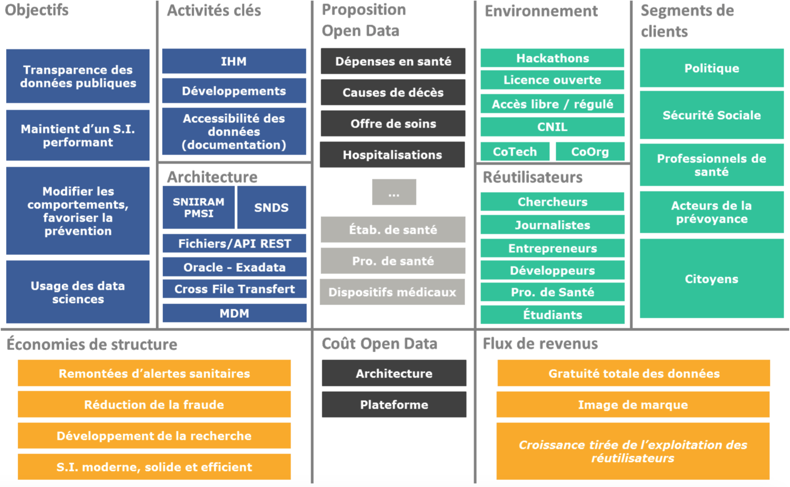
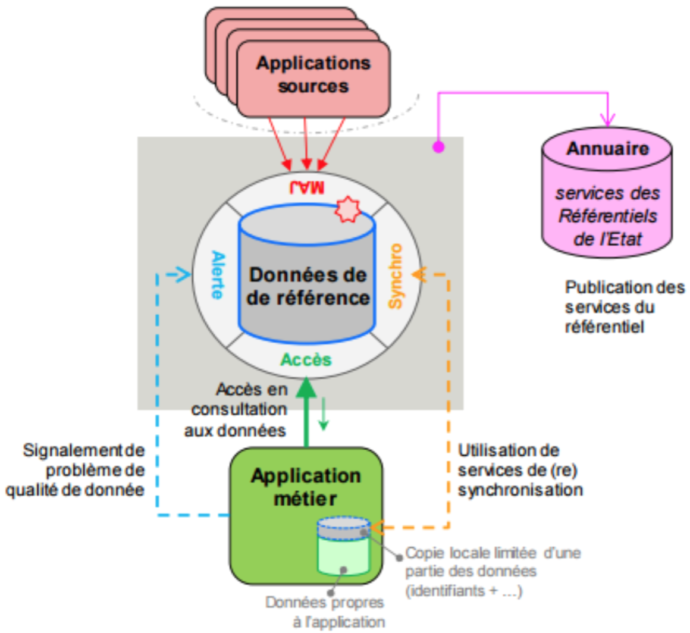
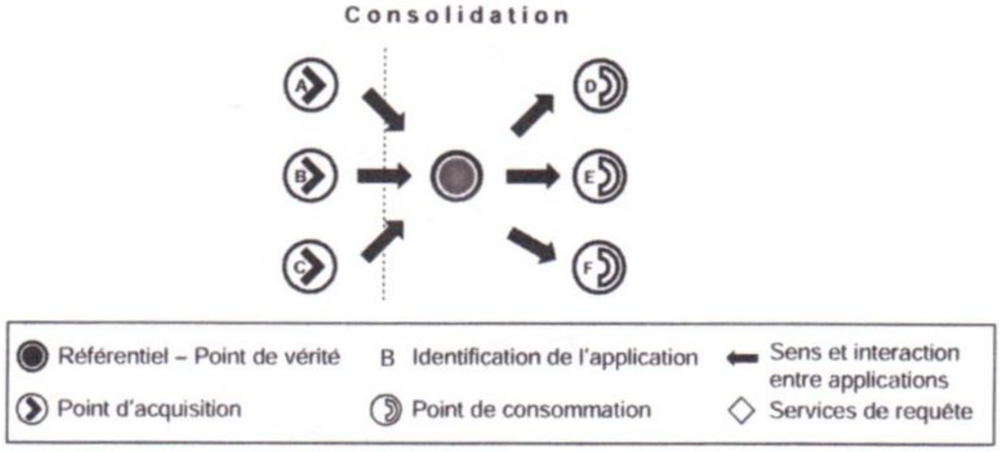

# 3.3. Préconisations

L’ouverture des données de santé, bien que votée, n’est pas encore en place. Ce chapitre vise à relever les axes à prendre en compte pour mettre en place une ouverture des données efficiente pour le fournisseur – ici l’AM – et suscitant l’intérêt des réutilisateurs.

## 3.3.1. Open Data Canvas

L’Open Data Canvas est une modélisation type pour composer et représenter intuitivement sa stratégie d’ouverture des données. Elle a été élaborée en 2014 par Nicolas TERPOLILLI et Jean- Baptiste TRICHOT.

Cet outil vise à expliciter les tenants et les aboutissants d’une ouverture des données en répondant à l’interrogation suivante : « quel business model pour ces données ? ».

L’open data se positionne comme l’axe autour duquel sont interfacés l’organisation et son environnement :

- à gauche est représenté le micro, ce qui est interne à l’organisation (objectifs, activités clés...) ;
- à droite figure ce qui est considéré comme macro, ce qui provient de l’extérieur (environnement,
réutilisateurs, clients...).
- les deux zones Proposition open data et Coût open data sont communes à l’organisation et à son environnement extérieur.


Selon ses auteurs, l’analyse de ce schéma permet d’identifier le résultat de la stratégie entreprise :

> [ 𝐸𝑐𝑜𝑛𝑜𝑚𝑖𝑒 𝑑𝑒 𝑠𝑡𝑟𝑢𝑐𝑡𝑢𝑟𝑒 + 𝑆𝑜𝑢𝑟𝑐𝑒𝑠 𝑑𝑒 𝑟𝑒𝑣𝑒𝑛𝑢𝑒𝑠 ] − 𝐶𝑜û𝑡 𝑑𝑒 𝑙′𝑜𝑝𝑒𝑛𝑑𝑎𝑡𝑎 = 𝑅é𝑠𝑢𝑙𝑡𝑎𝑡

Ci-dessous, figure la démarche appliquée à l’ouverture des données de santé selon les éléments évoqués au cours de ce mémoire.

*Open Data Canvas appliqué à l’ouverture des données de santé*

## 3.3.2. Simplification de la gouvernance

En l’état actuel, la gouvernance d’accès adoptée concernant les données de santé est en décalage avec la simplicité du monde informatique (une complexité détaillée aux chapitres précédents).
En cela, la règle d’accès serait simplifiée :


- les **données entièrement anonymes** à disposition du public,
- et **les données non entièrement anonymes** seraient accessibles après autorisation de la CNIL
selon les motivations et méthodes d’analyses présentées par le demandeur.


Cette gouvernance en plus d’être simplifiée dans son processus d’accessibilité, pourrait bénéficier d’une modernisation de la gestion des données. En effet, une initiative d’ouverture des données de santé doit être pensée sur le long terme et parvenir à mutualiser le maximum de ressources possibles. Il n’est bien sûr pas question d’accéder aux bases originales mais de simuler un système le plus semblable possible, comme nous l’avons vu précédemment, avec notamment la création du SNDS.


Pour y répondre, la gestion des données de référence (MDM) est un moyen à l’organisation de ces référentiels.


Les bénéfices d’une telle gestion pour un fournisseur résident essentiellement en deux points :

- mutualiser les coûts de synchronisation des données,
- faciliter la mise en place d’accès aux moyens de web services.

Il s’agirait toutefois d’un véritable défi technologique, de parvenir à faire fonctionner un système ayant comme source des bases de données de tailles exceptionnellement grandes.

Parmi l’ensemble des modèles de gestion des données de références connus, la typologie
« **consolidation** » semble la plus appropriée à l’ouverture des bases de l’AM :


*Pattern référentiel de consolidation. Source : Cadre commun d'architecture des référentiels de données*

Cette organisation est caractérisée par :

- la consommation de données provenant d’applications sources indépendantes,   - une faible intrusivité dans le S.I. et une autonomie des applications sources,
- une acquisition puis une restitution à des sous-systèmes consommateurs.


*Schéma de typologie d’architecture de consolidation. Source : Damien PLOIX – Cours MIAGE 2014-2015*

## 3.3.3. Mise en œuvre de l'open data

Outre l’aspect très macro que représente l’architecture d’une ouverture des données, il est important de ne pas négliger un aspect plus micro mais fondamental : l’architecture de la donnée.


### a. Principes fondamentaux

Dix règles ont été édictés en 2007 par le groupe de travail **Open Gouvernement data** :

1. **Complète** : toutes les données publiques doivent être mises à disposition du public. Les données
publiques sont des données non soumises à des limitations de confidentialité ou de sécurité.
2. **Primaire** : importance de disposer de données avec la granularité la plus fine possible. Dans le cas d’une agrégation de données, il faut pouvoir retrouver les données brutes à l’origine de la transformation.
3. **Actualisée** : la donnée est fraiche, de sorte à préserver sa valeur.
4. **Accessible** : nécessité de standardiser la mise à disposition de la donnée, afin qu’un maximum de
personnes puissent y accéder et en faire un usage le plus large possible.
5. Permettre un **traitement automatisé** : implique une structuration des données.
6. **Disponible** : disponibilité de la donnée pour chacun, sans accès restreint ni obligation d’enregistrement.
7. **Non propriétaire** : relativement au format, les données doivent être présentées dans un format ouvert (non-propriétaire)93.
8. **Libre** : la situation des données ouvertes doit être claire. Les données sans restrictions doivent être incluses dans le domaine public.
9. **Permanence** : le web est souvent modifié, remplacé ou supprimé sans traçabilité, ni alertes ou ni indications. Il est nécessaire pour une donnée ouverte, si elle est mise à disposition en un endroit, qu’elle y reste disponible avec un système d’archivage.
10. **Coût d’usage** : fait référence au coût d’accès. Le coût d’accès peut créer une barrière à l’entrée chez les acteurs qui souhaiteront utiliser ces données ; dans une démarche ouverte ce coût doit être réduit au strict minimum pour maximiser l’accès.

Ces dix principes fondamentaux ont été complétés en 2010 par d’autres principes supplémentaires :

- vérifiées et authentiques,
- figurante dans un catalogue de données,
- documentées,
- sûres,
- adaptées à la demande du public, c’est-à-dire à l’écoute des besoins des utilisateurs.

### b. Bonnes pratiques

En complément de principes fondamentaux, la communauté du libre a établi une liste de 72 bonnes pratiques. Ces bonnes pratiques sont publiées sous licence Creative Common95 afin qu’elles puissent être partagées, modifiées ou transformées librement. Elles apportent un cadre organisé dans l’objectif d’une mise en place d’une ouverture. L’étendue de ces actions est large :

- API,
- Applications,
- Catalogage,
- Format,
- Identification,
- Licence,
- Transparence,
- Utilisabilité,
- Vie privée...
